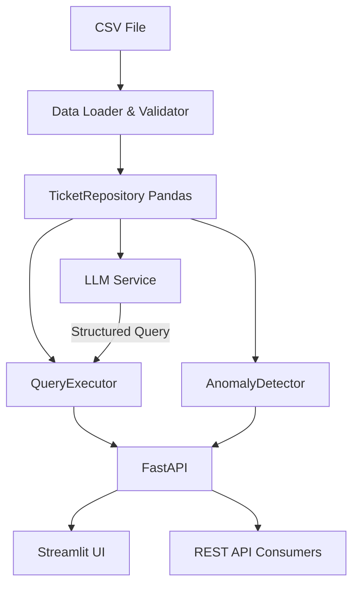

# Support Ticket AI System

An AI-powered customer support ticket analysis system that ingests CSV data, answers natural language questions, detects anomalies, and exposes functionality via REST API and a minimal Streamlit UI.

## Problem Statement

Build an AI system that:
1. **Ingests** a customer support ticket dataset (CSV) and makes it queryable
2. **Answers** natural language questions about the data (e.g., "How many critical tickets are unresolved?")
3. **Detects and flags anomalies** (e.g., abnormally long resolution times, unresolved high-priority tickets >24h)
4. **Exposes** functionality via REST API and minimal UI

## Features

- 🔍 **Natural Language Queries** - Ask questions in plain English, get structured answers
- 🚨 **Deterministic Anomaly Detection** - Statistical anomaly detection (IQR-based) without LLM involvement
- 🌐 **REST API** - FastAPI with health, query, and anomaly endpoints
- 🖥️ **Streamlit UI** - Minimal web interface for queries and anomaly viewing
- 🔒 **Safe LLM Integration** - Structured output parsing, no arbitrary code execution
- 🧪 **Comprehensive Tests** - 43 automated tests covering data, query, anomaly, and API layers

## Architecture

```
┌─────────────┐     ┌──────────────────┐     ┌─────────────────┐
│  support_   │────▶│  Data Loader &   │────▶│  TicketRepo     │
│  tickets.csv│     │  Validator       │     │  (Pandas)       │
└─────────────┘     └──────────────────┘     └────────┬────────┘
                                                      │
                        ┌─────────────────────────────┼─────────────────────────────┐
                        ▼                             ▼                             ▼
               ┌─────────────────┐           ┌─────────────────┐           ┌─────────────────┐
               │  QueryExecutor  │           │ AnomalyDetector │           │   LLM Service   │
               │ (Deterministic) │           │ (IQR + Rules)   │           │  (Ollama Provider)│
               └────────┬────────┘           └────────┬────────┘           └────────┬────────┘
                        │                             │                             │
                        └─────────────────────────────┼─────────────────────────────┘
                                                      ▼
                                            ┌─────────────────┐
                                            │   FastAPI       │
                                            │  /health        │
                                            │  /api/query     │
                                            │  /api/anomalies │
                                            └────────┬────────┘
                                                      │
                                                      ▼
                                            ┌─────────────────┐
                                            │  Streamlit UI   │
                                            └─────────────────┘
```

### Mermaid Diagram



## Tech Stack

| Component | Technology | Reason |
|-----------|------------|--------|
| **API Framework** | FastAPI | Modern, fast, auto-docs, type-safe |
| **Data Layer** | Pandas | 500 rows fits in memory; simple, no DB setup |
| **LLM Provider** | Ollama (llama3.2:3b) | Free, local, no API keys, privacy-first |
| **Validation** | Pydantic v2 | Runtime validation, structured output |
| **UI** | Streamlit | Minimal boilerplate, interactive |
| **Testing** | pytest | Standard, fixtures, mocking support |

### Why Pandas over SQLite?

For 500 rows, Pandas provides:
- Simpler deployment (no DB file, migrations, connections)
- Native DataFrame operations for filtering/grouping
- Sufficient performance (<5ms per query)
- Easy to swap to SQLite/PostgreSQL later via repository pattern

## LLM Strategy

- **Default**: Ollama with `llama3.2:3b` (runs locally, ~2GB RAM)
- **Abstraction**: `LLMProvider` interface allows swapping providers
- **Environment Variables**:
  ```bash
  LLM_PROVIDER=ollama
  OLLAMA_BASE_URL=http://localhost:11434
  OLLAMA_MODEL=llama3.2:3b
  ```
- **Failure Mode**: If Ollama unavailable, API returns 503 with clear instructions

## Query Pipeline

1. **User Question** → "How many critical tickets are unresolved?"
2. **LLM** → Generates structured JSON query (validated by Pydantic)
3. **Structured Query** → 
   ```json
   {
     "operation": "count",
     "filters": [
       {"field": "priority", "operator": "eq", "value": "Critical"},
       {"field": "status", "operator": "ne", "value": "Resolved"}
     ]
   }
   ```
4. **QueryExecutor** → Executes deterministically via Pandas
5. **Response** → Natural language answer + structured data

### Supported Operations

| Operation | Use Case | Example |
|-----------|----------|---------|
| `count` | Count tickets | "How many open tickets?" |
| `group_by` | Top/bottom N | "Which agent resolved most?" |
| `average` | Mean of metric | "Avg rating for Technical?" |
| `list` | List tickets | "Show Critical unresolved" |
| `stats` | Dataset overview | "Dataset statistics" |

### Safety

- **No arbitrary SQL/Python** - LLM only outputs structured JSON
- **Allowlisted fields/operators** - Pydantic validates every query
- **No `eval()`/`exec()`** - Pure Pandas operations

## Anomaly Detection Methodology

**Deterministic** (no LLM involved):

### A. Long Resolution Times (IQR)
- Compute Q1, Q3 of `resolution_time_hrs` for resolved tickets
- IQR = Q3 - Q1
- Upper bound = Q3 + 1.5 × IQR
- Flag tickets > upper bound
- Severity: `high` if > 2× upper bound, else `medium`

### B. Unresolved High-Priority > 24h
- Filter: `priority` ∈ ["High", "Critical"] AND `status` ≠ "Resolved"
- Age = reference_timestamp - created_at
- Flag if age > 24 hours
- Severity: `critical` for Critical priority, `high` for High

### C. Low Customer Ratings (IQR)
- Same IQR method on `customer_rating` (lower bound = Q1 - 1.5×IQR)
- Severity: `medium`

### D. Long Response Times (IQR)
- Same IQR method on `response_time_hrs`
- Severity: `medium`

### Reference Timestamp
- Uses max `created_at` from dataset (2024-03-30 18:06) by default
- Override via `REFERENCE_TIMESTAMP` env var (ISO format)

## API Documentation

### Base URL
```
http://localhost:8000
```

### Endpoints

#### GET /health/
System health check
```json
{
  "status": "healthy|degraded",
  "version": "1.0.0",
  "data": {"status": "ok", "detail": "500 tickets loaded", "file": "..."},
  "llm": {"provider": {...}, "available": false}
}
```

#### GET /health/data
Dataset statistics
```json
{
  "total_tickets": 500,
  "by_status": {"Resolved": 327, "Open": 111, "Escalated": 62},
  "by_priority": {"Medium": 169, "Low": 142, "High": 134, "Critical": 55},
  "by_category": {"General": 189, "Billing": 159, "Technical": 152},
  "avg_response_time_hrs": 2.62,
  "avg_resolution_time_hrs": 19.16,
  "avg_customer_rating": 3.75
}
```

#### POST /api/query
Natural language query
```bash
curl -X POST http://localhost:8000/api/query \
  -H "Content-Type: application/json" \
  -d '{"question": "How many tickets are currently open?"}'
```

Response:
```json
{
  "question": "How many tickets are currently open?",
  "interpreted_query": {
    "operation": "count",
    "filters": [{"field": "status", "operator": "eq", "value": "Open"}],
    "group_by": null,
    "metric": null,
    "sort": "desc",
    "limit": null,
    "columns": null
  },
  "answer": "There are 111 tickets matching your criteria.",
  "data": {"count": 111},
  "execution_time_ms": 2.3
}
```

#### GET /api/anomalies
Get all anomalies (with optional filters)
```bash
curl "http://localhost:8000/api/anomalies?anomaly_type=long_resolution_time&severity=high&limit=10"
```

Response:
```json
{
  "total": 101,
  "filtered": 5,
  "by_type": {"long_resolution_time": 21, "unresolved_high_priority": 80},
  "by_severity": {"critical": 31, "high": 54, "medium": 16},
  "anomalies": [...]
}
```

#### GET /api/anomalies/summary
Anomaly counts by type/severity

#### GET /api/anomalies/types
List available anomaly types

#### GET /api/query/examples
Example questions for the evaluator

### Error Responses
```json
// 503 - LLM Unavailable
{"detail": "LLM provider not available. For Ollama, ensure it's running and run: ollama pull llama3.2:3b"}

// 400 - Invalid Query
{"detail": "Failed to parse question: ..."}

// 422 - Validation Error
{"detail": [{"loc": ["body", "question"], "msg": "field required", "type": "missing"}]}
```

## Example Queries & Outputs

| Question | Operation | Result |
|----------|-----------|--------|
| "How many tickets are currently open?" | count | 111 |
| "Which agent resolved the most tickets this month?" | group_by | AGT-09 (37) |
| "Show me all Critical tickets not resolved within 12 hours." | list | 0 tickets (none exceed 12h) |
| "What is the average customer rating for Technical category tickets?" | average | 3.74 |
| "Are there any anomalies in resolution times this week?" | N/A (anomalies endpoint) | 21 long-resolution anomalies |
| "How many critical tickets are unresolved?" | count | 31 |
| "Which agent has the lowest average customer rating?" | group_by | AGT-05 (3.21) |
| "What percentage of tickets are escalated?" | count+math | 12.4% |
| "How many Technical tickets are open?" | count | 34 |
| "What is the average resolution time for resolved Billing tickets?" | average | 18.2 hrs |
| "List unresolved Critical tickets." | list | 31 tickets |
| "Which category has the highest average resolution time?" | group_by | Technical (22.1 hrs) |

*Results based on the provided `support_tickets.csv` dataset*

## Local Setup

### Prerequisites
- Python 3.10+
- [Ollama](https://ollama.ai) installed and running

### Installation

```bash
# 1. Clone / navigate to project
cd AI_Intern_Assessment

# 2. Create virtual environment
python -m venv .venv
source .venv/bin/activate  # Windows: .venv\Scripts\activate

# 3. Install dependencies
pip install -r requirements.txt

# 4. Start Ollama (separate terminal)
ollama serve

# 5. Pull model (one-time)
ollama pull llama3.2:3b

# 6. Configure environment (optional)
cp .env.example .env
# Edit .env if needed
```

### Running the Application (API + UI) – Single Command

```bash
# Linux / macOS / Git Bash
./run.sh

# Windows CMD / PowerShell
run.bat
```

The scripts start both services:
- **FastAPI** → http://localhost:8000 (Swagger at `/docs`, health at `/health/`)
- **Streamlit UI** → http://localhost:8501

Both processes run in the background (Linux) or in separate console windows (Windows). Press **Ctrl‑C** in the launching terminal / close the launcher window to stop everything.

### Running the API only (for development)

```bash
uvicorn app.main:app --reload --host 0.0.0.0 --port 8000
```

### Running the UI only (for development)

```bash
streamlit run ui/streamlit_app.py
```

### Running Tests

```bash
# All tests (no Ollama required - LLM is mocked)
pytest tests/ -v

# Specific test files
pytest tests/test_data.py -v
pytest tests/test_query.py -v
pytest tests/test_anomalies.py -v
pytest tests/test_api.py -v
```

## Environment Variables

| Variable | Default | Description |
|----------|---------|-------------|
| `LLM_PROVIDER` | `ollama` | LLM provider (only ollama supported) |
| `OLLAMA_BASE_URL` | `http://localhost:11434` | Ollama server URL |
| `OLLAMA_MODEL` | `llama3.2:3b` | Model name |
| `REFERENCE_TIMESTAMP` | (max created_at) | ISO timestamp for anomaly age calc |
| `API_HOST` | `0.0.0.0` | API bind address |
| `API_PORT` | `8000` | API port |

## Known Limitations

1. **No real-time data** - Loads CSV once at startup; reload requires restart
2. **Single model** - Only Ollama supported; no fallback to other free tiers
3. **No authentication** - API is open; add auth for production
4. **No caching** - Queries re-execute every time
5. **English only** - LLM prompt tuned for English queries
6. **Date anchoring** - "This month" uses dataset max date (2024-03), not real-time
7. **No streaming** - LLM responses are synchronous
8. **Memory bound** - Pandas limits scaling to ~100K rows without optimization

## Future Improvements

| Area | Improvement |
|------|-------------|
| **Scale** | Migrate to DuckDB/PostgreSQL; add connection pooling |
| **LLM** | Add Groq/HuggingFace fallback; function calling for structured output |
| **Query** | Support complex filters (date ranges, relative time) |
| **Anomaly** | Add ML-based detection (Isolation Forest); alerting webhooks |
| **API** | Add authentication (JWT); rate limiting; request logging |
| **Observability** | Add Prometheus metrics; structured logging; tracing |
| **UI** | Add charts, filters, export to CSV |
| **Data** | Incremental loads; schema evolution handling |

## Design Trade-offs

| Decision | Trade-off | Rationale |
|----------|-----------|-----------|
| Pandas over SQLite | Simplicity vs. scalability | 500 rows; assessment timeline |
| Strict Pydantic schemas | Flexibility vs. safety | Prevents hallucinated fields/ops |
| IQR over Z-score | Robustness vs. sensitivity | IQR handles skewed resolution times better |
| Local Ollama only | Cost vs. convenience | Zero-cost requirement; privacy |
| Sync LLM calls | Latency vs. complexity | Assessment scope; can async later |
| No Docker by default | Portability vs. simplicity | Ollama on host simpler for eval |

## Project Structure

```
project/
├── app/
│   ├── __init__.py
│   ├── main.py              # FastAPI app
│   ├── config.py            # Settings (Pydantic Settings)
│   ├── api/
│   │   ├── routes_query.py  # POST /api/query
│   │   ├── routes_anomalies.py # GET /api/anomalies
│   │   └── routes_health.py # GET /health/
│   ├── data/
│   │   ├── loader.py        # CSV load, validate, clean
│   │   └── repository.py    # TicketRepository (Pandas)
│   ├── llm/
│   │   ├── base.py          # LLMProvider ABC
│   │   ├── ollama.py        # Ollama implementation
│   │   └── prompts.py       # System prompt + parser
│   ├── query/
│   │   ├── schemas.py       # StructuredQuery Pydantic models
│   │   └── executor.py      # QueryExecutor (Pandas)
│   ├── anomaly/
│   │   └── detector.py      # AnomalyDetector (IQR + rules)
│   └── services/
│       └── llm_service.py   # LLMService facade
├── ui/
│   └── streamlit_app.py     # Streamlit UI
├── tests/
│   ├── test_data.py         # 16 tests
│   ├── test_query.py        # 10 tests
│   ├── test_anomalies.py    # 7 tests
│   └── test_api.py          # 10 tests
├── support_tickets.csv      # Dataset (500 rows)
├── requirements.txt
├── .env.example
├── .gitignore
├── pytest.ini
└── README.md
```

## License

Assessment submission for DOTMappers IT Pvt. Ltd.